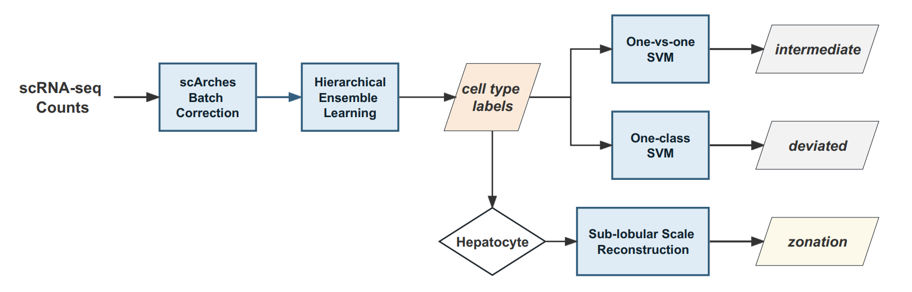
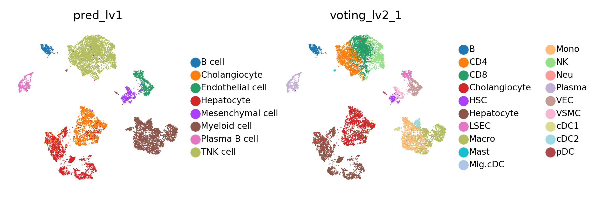
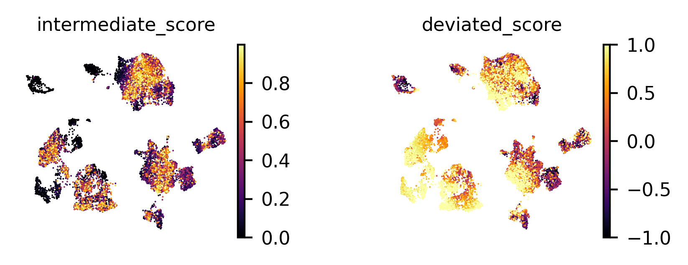

# LiverCT: machine learning based Liver Cell Type mapping
## Introduction
We developed LiverCT (machine learning based Liver Cell Type mapping), for mapping new datasets onto the normal liver atlas. The method mainly contains three parts:
- **Cell type classification**: Provide predictions for two levels of cell type labels. 
- **"Variant" state identification**: Identify cells potentially in deviated states and intermediate states. 
- **Hepatocyte zonation reconstruction**: Specifically for hepatocytes, provide zonation reconstruction labels along the CV-PV axis at sub-lobule scale.
V
The work logic flow of LiverCT is shown as below: 



## Requirements

LiverCT's dependencies can be found in requirements.txt in this repository. 
> numpy==1.22.4  
scipy==1.8.1  
pandas==1.4.3  
anndata==0.8.0  
scanpy==1.9.1  
scArches==0.5.9  
joblib==1.1.0  
scikit_learn==1.1.1  
xgboost==1.7.6  

## Quick start
Here, we provide an example data of hcc from uniLIVER. Users can download it and run following scripts to understand the workflow of LiverCT. Also see demo.ipynb in this repository.

```python
import os
import gdown
import shutil
import warnings
warnings.filterwarnings("ignore")

from liverct_annot import *
```
### download trained models from zenodo


```python
url = "https://zenodo.org/record/8239570/files/models.zip"
output_folder = "../test_folder/"
os.makedirs(output_folder) 
gdown.download(url, output_folder + "LiverCT_models.zip", quiet=False)

extract_dir = "../test_folder/LiverCT_models/"
shutil.unpack_archive(output_folder + "LiverCT_models.zip", extract_dir=extract_dir)
os.remove(output_folder + "LiverCT_models.zip")
```

### download query dataset from zenodo

```python
url = "https://zenodo.org/record/8239570/files/example_data_Lu2022_downsampled.h5ad"
gdown.download(url, output_folder + "example_data_Lu2022_downsampled.h5ad", quiet=False)
adata = sc.read_h5ad(output_folder + "example_data_Lu2022_downsampled.h5ad")
```
### Annotate cell types and intermediate/deviated states

```python
res, latent = cell_states_annot(model_dir=extract_dir + "models/",
                                adata_test=adata, finetune_epoch=20)
```

### Annotate hepatocyte zonation groups

```python
# select cells labeled as Hepatocyte
hep = adata[res['voting_lv2_1'] == "Hepatocyte"]
# "donor_ID" here is the keyword used as _scvi_batch; if not provided, all cells are treated as one batch
hep.obs['donor_ID'] = list(hep.obs['Patient_ID'])
hep_res, hep_latent = hep_zonation_annot(model_dir=extract_dir + "models/",
                                         hepatocyte_adata=hep, finetune_epoch=20)
hep_res
```

### Visualize results

```python
# calculate umap using latent vectors
latent.obs = pd.concat([adata.obs, res], axis=1)
latent.obs['hep_zonation'] = None
latent.obs['hep_zonation'][hep.obs_names] = list(hep_res)

sc.pp.neighbors(latent, use_rep='X')
sc.tl.umap(latent)

# plot umap
sc.settings.set_figure_params(dpi=200, figsize=(2,2), frameon=False)
sc.pl.umap(latent, color=['pred_lv1', 'voting_lv2_1'], size=20000 / latent.n_obs, legend_fontsize=6)

sc.settings.set_figure_params(dpi=200, figsize=(1.5,1.5), frameon=False)
sc.pl.umap(latent, color=['intermediate_score', 'deviated_score'], size=20000 / latent.n_obs)
sc.pl.umap(latent, color=['intermediate_state', 'deviated_state', 'hep_zonation'], size=20000 / latent.n_obs, legend_fontsize=6)
```
    



