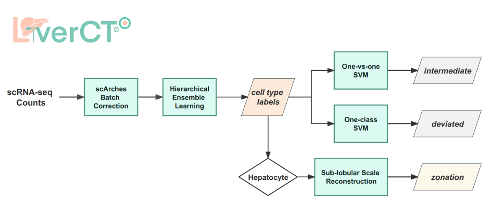
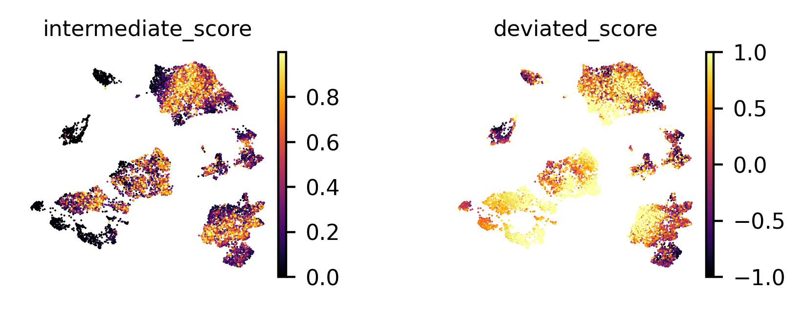
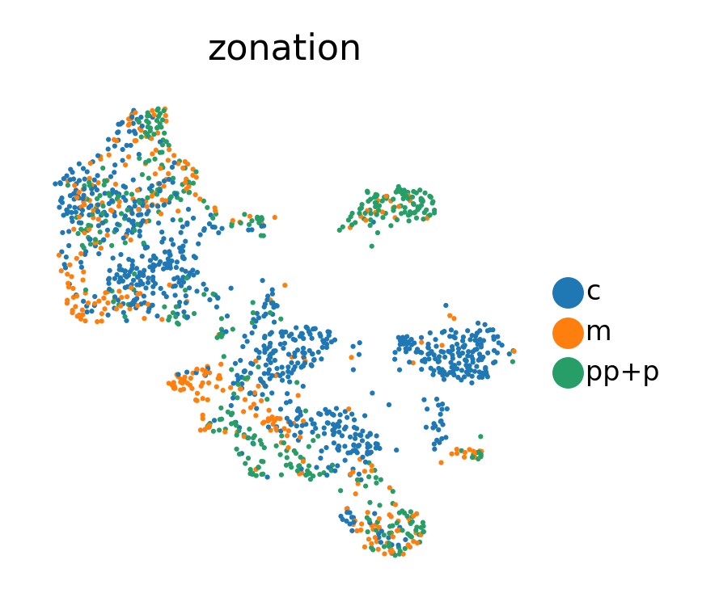

# LiverCT: machine learning based Liver Cell Type mapping
## Introduction
We developed LiverCT (machine learning based Liver Cell Type mapping), for mapping new datasets onto the normal liver atlas. The method mainly contains three parts:
- **Cell type classification**: Provide predictions for two levels of cell type labels. 
- **"Variant" state identification**: Identify cells potentially in deviated states and intermediate states. 
- **Hepatocyte zonation reconstruction**: Specifically for hepatocytes, provide zonation reconstruction labels along the CV-PV axis at sub-lobule scale.

The work logic flow of LiverCT is shown as below: 



The code below can be obtained from https://github.com/fyh18/LiverCT

## Installation

LiverCT is built on python 3.9.7. LiverCT's dependencies can be found in requirements.txt in this repository. 

Create a conda environment: 

```
conda create -n liverct python=3.9.7
conda activate liverct
```


Clone LiverCT from GitHub: 

```
cd dir_to_save_the_code
git clone https://github.com/fyh18/LiverCT.git
cd LiverCT
```
Prepare the environment for LiverCT: 

```
pip install -r requirements.txt
```

## Quick start
Here, we provide an example to annotate a dataset (Lu2022) of HCC by LiverCT. The following tutorial can help you quickly understand how LiverCT works. If you'd like, you can also directly run **demo.ipynb** in this repository.

```python
import os
import gdown
import shutil
import warnings
warnings.filterwarnings("ignore")

from liverct_annot import *
```
### Download trained models from zenodo


```python
url = "https://zenodo.org/record/8239570/files/models.zip"
output_folder = "../test_folder/"
os.makedirs(output_folder) 
gdown.download(url, output_folder + "LiverCT_models.zip", quiet=False)

extract_dir = "../test_folder/LiverCT_models/"
shutil.unpack_archive(output_folder + "LiverCT_models.zip", extract_dir=extract_dir)
os.remove(output_folder + "LiverCT_models.zip")
```

### Download query dataset from zenodo

```python
url = "https://zenodo.org/record/8239570/files/example_data_Lu2022_downsampled.h5ad"
gdown.download(url, output_folder + "example_data_Lu2022_downsampled.h5ad", quiet=False)
adata = sc.read_h5ad(output_folder + "example_data_Lu2022_downsampled.h5ad")
```
### Annotate cell types and intermediate/deviated states

```python
# adata.obs["batch"] is used as _scvi_batch; if not provided, all cells are treated as one batch.
res, latent = cell_states_annot(model_dir=extract_dir + "models/",
                                adata_test=adata, finetune_epoch=20)
```

### Visualize annotation results

```python
latent.obs = pd.concat([adata.obs, res], axis=1)
sc.pp.neighbors(latent, use_rep='X')
sc.tl.umap(latent)

sc.settings.set_figure_params(dpi=200, figsize=(2,2), frameon=False, fontsize=8)
sc.pl.umap(latent, color=['pred_lv1', 'voting_lv2_1'], size=20000 / latent.n_obs, legend_fontsize=6)

sc.settings.set_figure_params(dpi=200, figsize=(1.5,1.5), frameon=False, fontsize=8)
sc.pl.umap(latent, color=['intermediate_score', 'deviated_score'],
           size=20000 / latent.n_obs, legend_fontsize=6, color_map='inferno')
```




### Annotate hepatocyte zonation groups

```python
# select cells labeled as Hepatocyte
hep = adata[res['voting_lv2_1'] == "Hepatocyte"]
# "donor_ID" here is the keyword used as _scvi_batch; if not provided, all cells are treated as one batch
hep.obs['donor_ID'] = list(hep.obs['Patient_ID'])
hep_res, hep_latent = hep_zonation_annot(model_dir=extract_dir + "models/",
                                         hepatocyte_adata=hep, finetune_epoch=20)
```

### Visualize zonation results

```python
hep_latent.obs['zonation'] = list(hep_res)
sc.pp.neighbors(hep_latent, use_rep='X')
sc.tl.umap(hep_latent)
sc.settings.set_figure_params(dpi=200, figsize=(2,2), frameon=False, fontsize=8)
sc.pl.umap(hep_latent, color=['zonation'], size=50000 / latent.n_obs, legend_fontsize=6)
```
    
