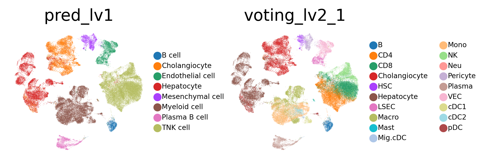
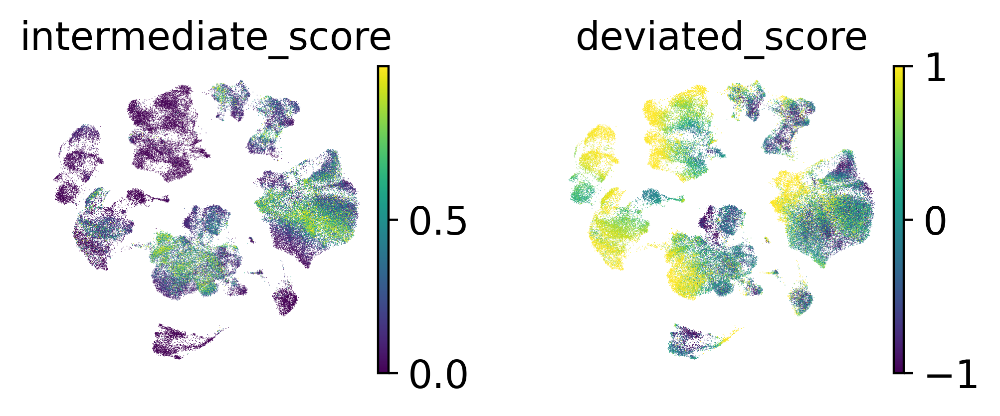
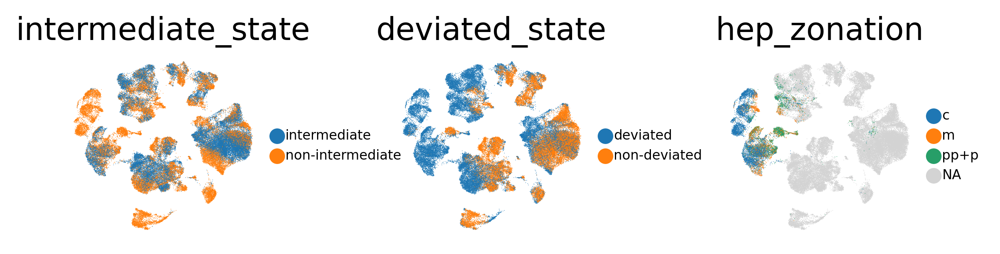

# A demo to annotate a HCC dataset(Lu2022) by LiverCT

Yuhan Fan, 2023/08/13

### download trained models from zenodo


```python
import os
import gdown
import shutil

url = "https://zenodo.org/record/8239570/files/models.zip"
output = "/home/wyh/liver_atlas/model/LiverCT_models.zip"
gdown.download(url, output, quiet=False)
shutil.unpack_archive(output, extract_dir="/home/wyh/liver_atlas/model/LiverCT_models/")
os.remove(output)
```

    /home/wyh/anaconda3/envs/cell2loc_env/lib/python3.9/site-packages/requests/__init__.py:102: RequestsDependencyWarning: urllib3 (1.26.8) or chardet (5.1.0)/charset_normalizer (2.0.4) doesn't match a supported version!
      warnings.warn("urllib3 ({}) or chardet ({})/charset_normalizer ({}) doesn't match a supported "
    Downloading...
    From: https://zenodo.org/record/8239570/files/models.zip
    To: /home/wyh/liver_atlas/model/LiverCT_models.zip
    100%|██████████| 70.2M/70.2M [04:19<00:00, 270kB/s]


### load query data


```python
import scanpy as sc
adata = sc.read_h5ad("/home/wyh/liver_atlas/data/Lu2022/Lu2022_43878.h5ad")
adata
```

    <frozen importlib._bootstrap>:228: RuntimeWarning: scipy._lib.messagestream.MessageStream size changed, may indicate binary incompatibility. Expected 56 from C header, got 64 from PyObject


    AnnData object with n_obs × n_vars = 71915 × 43878
        obs: 'orig.ident', 'nCount_RNA', 'nFeature_RNA', 'Cell_ID', 'Sample_ID', 'Original_name_global', 'Original_name_sub', 'State', 'Patient_ID', 'Sample_status', 'Sample_status_original', 'Seq_tech', 'GEO_accession', 'Source', 'Gender', 'Age', 'Disease', 'Fibrotic_status', 'Author', 'Virus_infection', 'TNM', 'batch'
        var: 'features'


### Annotate cell types and intermediate/deviated states


```python
from liverct_annot import *
res, latent = cell_states_annot(model_dir="/home/wyh/liver_atlas/model/LiverCT_models/models/",
                                adata_test=adata, finetune_epoch=20)
res
```

    WARNING:root:In order to use the mouse gastrulation seqFISH datsets, please install squidpy (see https://github.com/scverse/squidpy).
    INFO:pytorch_lightning.utilities.seed:Global seed set to 0
    WARNING:root:In order to use sagenet models, please install pytorch geometric (see https://pytorch-geometric.readthedocs.io) and 
     captum (see https://github.com/pytorch/captum).
    WARNING:root:mvTCR is not installed. To use mvTCR models, please install it first using "pip install mvtcr"
    WARNING:root:multigrate is not installed. To use multigrate models, please install it first using "pip install multigrate".
    /home/wyh/liver_atlas/code/LiverCT/liverct_annot.py:34: ImplicitModificationWarning: Trying to modify attribute `.obs` of view, initializing view as actual.
      test.obs['batch'] = list(meta['batch'])
    /home/wyh/anaconda3/envs/cell2loc_env/lib/python3.9/contextlib.py:126: FutureWarning: X.dtype being converted to np.float32 from float64. In the next version of anndata (0.9) conversion will not be automatic. Pass dtype explicitly to avoid this warning. Pass `AnnData(X, dtype=X.dtype, ...)` to get the future behavour.
      next(self.gen)


    INFO     Using data from adata.layers["counts"]                                              


    /home/wyh/anaconda3/envs/cell2loc_env/lib/python3.9/site-packages/scvi/model/base/_archesmixin.py:95: UserWarning: Query integration should be performed using models trained with version >= 0.8
      warnings.warn(
    /home/wyh/anaconda3/envs/cell2loc_env/lib/python3.9/site-packages/sklearn/utils/deprecation.py:87: FutureWarning: Function transfer_anndata_setup is deprecated; This method will be removed in 0.15.0. Please avoid building any new dependencies on it.
      warnings.warn(msg, category=FutureWarning)
    INFO:scvi.data._anndata:Using data from adata.layers["counts"]


    INFO     Registered keys:['X', 'batch_indices', 'labels']                                    


    INFO:scvi.data._anndata:Registered keys:['X', 'batch_indices', 'labels']


    INFO     Successfully registered anndata object containing 71915 cells, 2000 vars, 22        
             batches, 9 labels, and 0 proteins. Also registered 0 extra categorical covariates   
             and 0 extra continuous covariates.                                                  


    INFO:scvi.data._anndata:Successfully registered anndata object containing 71915 cells, 2000 vars, 22 batches, 9 labels, and 0 proteins. Also registered 0 extra categorical covariates and 0 extra continuous covariates.


    INFO     Training for 20 epochs.                                                             


    INFO:scvi.model._scanvi:Training for 20 epochs.
    INFO:pytorch_lightning.utilities.distributed:GPU available: True, used: True
    INFO:pytorch_lightning.utilities.distributed:TPU available: False, using: 0 TPU cores
    INFO:pytorch_lightning.accelerators.gpu:LOCAL_RANK: 0 - CUDA_VISIBLE_DEVICES: [0,1,2,3]


    Epoch 1/20:   0%|          | 0/20 [00:00<?, ?it/s]

    /home/wyh/anaconda3/envs/cell2loc_env/lib/python3.9/site-packages/scvi/distributions/_negative_binomial.py:97: UserWarning: Specified kernel cache directory could not be created! This disables kernel caching. Specified directory is /home/wyh/.cache/torch/kernels. This warning will appear only once per process. (Triggered internally at  /opt/conda/conda-bld/pytorch_1646756402876/work/aten/src/ATen/native/cuda/jit_utils.cpp:860.)
      + torch.lgamma(x + theta)


    Epoch 20/20: 100%|██████████| 20/20 [02:36<00:00,  7.84s/it, loss=1.14e+03, v_num=1]
    2023-08-13 23:24:37.763673 Test set feature selection start
    Normalization has been escaped.
    2023-08-13 23:24:37.763787 Test set lv1 predict start...
    2023-08-13 23:24:39.747417 Test set lv2 predict start...
    2023-08-13 23:24:39.803927 B cell lv2 predict...
    B cell predict is finished in 0.024661
    2023-08-13 23:24:39.828682 Cholangiocyte lv2 predict...
    Cholangiocyte predict is finished in 0.081302
    2023-08-13 23:24:39.910067 Endothelial cell lv2 predict...


    /home/wyh/liver_atlas/code/LiverCT/test_function.py:142: ImplicitModificationWarning: Trying to modify attribute `.obs` of view, initializing view as actual.
      adata_part.obs["voting_lv2_1"] = celltype_tree[g_label][0]  # adata_part.obs['pred_lv1']
    /home/wyh/liver_atlas/code/LiverCT/test_function.py:142: ImplicitModificationWarning: Trying to modify attribute `.obs` of view, initializing view as actual.
      adata_part.obs["voting_lv2_1"] = celltype_tree[g_label][0]  # adata_part.obs['pred_lv1']
    /home/wyh/liver_atlas/code/LiverCT/test_function.py:109: ImplicitModificationWarning: Trying to modify attribute `.obs` of view, initializing view as actual.
      adata_part.obs["voting_lv2_1"] = list(clf2.classes_[rank[:, -1]])
    /home/wyh/liver_atlas/code/LiverCT/test_function.py:142: ImplicitModificationWarning: Trying to modify attribute `.obs` of view, initializing view as actual.
      adata_part.obs["voting_lv2_1"] = celltype_tree[g_label][0]  # adata_part.obs['pred_lv1']


    Endothelial cell predict is finished in 0.190487
    2023-08-13 23:24:40.100639 Hepatocyte lv2 predict...
    Hepatocyte predict is finished in 0.094143
    2023-08-13 23:24:40.194877 Mesenchymal cell lv2 predict...


    /home/wyh/liver_atlas/code/LiverCT/test_function.py:109: ImplicitModificationWarning: Trying to modify attribute `.obs` of view, initializing view as actual.
      adata_part.obs["voting_lv2_1"] = list(clf2.classes_[rank[:, -1]])


    Mesenchymal cell predict is finished in 0.158128
    2023-08-13 23:24:40.353099 Myeloid cell lv2 predict...


    /home/wyh/liver_atlas/code/LiverCT/test_function.py:109: ImplicitModificationWarning: Trying to modify attribute `.obs` of view, initializing view as actual.
      adata_part.obs["voting_lv2_1"] = list(clf2.classes_[rank[:, -1]])


    Myeloid cell predict is finished in 0.901972
    2023-08-13 23:24:41.255210 Plasma B cell lv2 predict...
    Plasma B cell predict is finished in 0.034468
    2023-08-13 23:24:41.289756 TNK cell lv2 predict...


    /home/wyh/liver_atlas/code/LiverCT/test_function.py:142: ImplicitModificationWarning: Trying to modify attribute `.obs` of view, initializing view as actual.
      adata_part.obs["voting_lv2_1"] = celltype_tree[g_label][0]  # adata_part.obs['pred_lv1']
    /home/wyh/liver_atlas/code/LiverCT/test_function.py:109: ImplicitModificationWarning: Trying to modify attribute `.obs` of view, initializing view as actual.
      adata_part.obs["voting_lv2_1"] = list(clf2.classes_[rank[:, -1]])


    TNK cell predict is finished in 0.689876


    /home/wyh/liver_atlas/code/LiverCT/test_function.py:196: ImplicitModificationWarning: Trying to modify attribute `.obs` of view, initializing view as actual.
      test_adata.obs['suggest_label_lv1'] = list(label_lv1)
    /home/wyh/liver_atlas/code/LiverCT/test_function.py:213: SettingWithCopyWarning: 
    A value is trying to be set on a copy of a slice from a DataFrame
    
    See the caveats in the documentation: https://pandas.pydata.org/pandas-docs/stable/user_guide/indexing.html#returning-a-view-versus-a-copy
      oc_score[oc_score > 1] = 1
    /home/wyh/liver_atlas/code/LiverCT/test_function.py:214: SettingWithCopyWarning: 
    A value is trying to be set on a copy of a slice from a DataFrame
    
    See the caveats in the documentation: https://pandas.pydata.org/pandas-docs/stable/user_guide/indexing.html#returning-a-view-versus-a-copy
      oc_score[oc_score < -1] = -1
    /home/wyh/liver_atlas/code/LiverCT/test_function.py:216: SettingWithCopyWarning: 
    A value is trying to be set on a copy of a slice from a DataFrame
    
    See the caveats in the documentation: https://pandas.pydata.org/pandas-docs/stable/user_guide/indexing.html#returning-a-view-versus-a-copy
      ovo_score[ovo_score > 1] = 1


<div>
<style scoped>
    .dataframe tbody tr th:only-of-type {
        vertical-align: middle;
    }

    .dataframe tbody tr th {
        vertical-align: top;
    }

    .dataframe thead th {
        text-align: right;
    }
</style>
<table border="1" class="dataframe">
  <thead>
    <tr style="text-align: right;">
      <th></th>
      <th>suggest_label_lineage</th>
      <th>suggest_label_lv1</th>
      <th>suggest_label_lv2</th>
      <th>pred_lv1</th>
      <th>voting_lv2_1</th>
      <th>voting_lv2_2</th>
      <th>intermediate_score</th>
      <th>deviated_score</th>
      <th>intermediate_state</th>
      <th>deviated_state</th>
    </tr>
  </thead>
  <tbody>
    <tr>
      <th>HCC01T_AAACCTGAGGGCATGT</th>
      <td>Lymphoid</td>
      <td>TNK cell</td>
      <td>CD8</td>
      <td>TNK cell</td>
      <td>CD8</td>
      <td>CD4</td>
      <td>0.207671</td>
      <td>0.692808</td>
      <td>intermediate</td>
      <td>deviated</td>
    </tr>
    <tr>
      <th>HCC01T_AAACCTGAGTCGCCGT</th>
      <td>Myeloid</td>
      <td>Myeloid cell</td>
      <td>Mono</td>
      <td>Myeloid cell</td>
      <td>Mono</td>
      <td>Macro</td>
      <td>0.550968</td>
      <td>0.473674</td>
      <td>intermediate</td>
      <td>deviated</td>
    </tr>
    <tr>
      <th>HCC01T_AAACCTGCATTACCTT</th>
      <td>Lymphoid</td>
      <td>TNK cell</td>
      <td>CD8</td>
      <td>TNK cell</td>
      <td>CD8</td>
      <td>NK</td>
      <td>0.588049</td>
      <td>0.819665</td>
      <td>intermediate</td>
      <td>deviated</td>
    </tr>
    <tr>
      <th>HCC01T_AAACCTGGTCACACGC</th>
      <td>Lymphoid</td>
      <td>TNK cell</td>
      <td>CD4</td>
      <td>TNK cell</td>
      <td>CD4</td>
      <td>CD8</td>
      <td>0.048813</td>
      <td>0.068883</td>
      <td>non-intermediate</td>
      <td>deviated</td>
    </tr>
    <tr>
      <th>HCC01T_AAACCTGTCCAGTATG</th>
      <td>Lymphoid</td>
      <td>TNK cell</td>
      <td>CD4</td>
      <td>TNK cell</td>
      <td>CD4</td>
      <td>NK</td>
      <td>0.025520</td>
      <td>0.258551</td>
      <td>non-intermediate</td>
      <td>deviated</td>
    </tr>
    <tr>
      <th>...</th>
      <td>...</td>
      <td>...</td>
      <td>...</td>
      <td>...</td>
      <td>...</td>
      <td>...</td>
      <td>...</td>
      <td>...</td>
      <td>...</td>
      <td>...</td>
    </tr>
    <tr>
      <th>HCC06T_TTTGTCACAGTATGCT</th>
      <td>Plasma B cel</td>
      <td>Plasma B cel</td>
      <td>Plasma</td>
      <td>Plasma B cell</td>
      <td>Plasma</td>
      <td>Unclassified</td>
      <td>0.000000</td>
      <td>-1.000000</td>
      <td>non-intermediate</td>
      <td>non-deviated</td>
    </tr>
    <tr>
      <th>HCC06T_TTTGTCAGTCCAAGTT</th>
      <td>Plasma B cel</td>
      <td>Plasma B cel</td>
      <td>Plasma</td>
      <td>Plasma B cell</td>
      <td>Plasma</td>
      <td>Unclassified</td>
      <td>0.000000</td>
      <td>-1.000000</td>
      <td>non-intermediate</td>
      <td>non-deviated</td>
    </tr>
    <tr>
      <th>HCC06T_TTTGTCAGTTTGCATG</th>
      <td>Myeloid</td>
      <td>Myeloid cell</td>
      <td>Mono</td>
      <td>Myeloid cell</td>
      <td>Mono</td>
      <td>Macro</td>
      <td>0.221688</td>
      <td>0.607958</td>
      <td>intermediate</td>
      <td>deviated</td>
    </tr>
    <tr>
      <th>HCC06T_TTTGTCATCCTGTACC</th>
      <td>Myeloid</td>
      <td>Myeloid cell</td>
      <td>Mono</td>
      <td>Myeloid cell</td>
      <td>Mono</td>
      <td>Macro</td>
      <td>0.743149</td>
      <td>0.483036</td>
      <td>intermediate</td>
      <td>deviated</td>
    </tr>
    <tr>
      <th>HCC06T_TTTGTCATCGACAGCC</th>
      <td>Lymphoid</td>
      <td>TNK cell</td>
      <td>CD4</td>
      <td>TNK cell</td>
      <td>CD4</td>
      <td>CD8</td>
      <td>0.101259</td>
      <td>0.202192</td>
      <td>non-intermediate</td>
      <td>deviated</td>
    </tr>
  </tbody>
</table>
<p>71915 rows × 10 columns</p>
</div>


### Annotate hepatocyte zonation groups


```python
# select cells originally labeled as hepatocyte by the author
hep = adata[adata.obs['Original_name_global'] == "Hepatocyte"]
hep.obs['donor_ID'] = list(hep.obs['Patient_ID'])
hep_res, hep_latent = hep_zonation_annot(model_dir="/home/wyh/liver_atlas/model/LiverCT_models/models/",
                                         hepatocyte_adata=hep, finetune_epoch=20)
hep_res
```

    /tmp/ipykernel_903185/2682461185.py:3: ImplicitModificationWarning: Trying to modify attribute `.obs` of view, initializing view as actual.
      hep.obs['donor_ID'] = list(hep.obs['Patient_ID'])
    /home/wyh/anaconda3/envs/cell2loc_env/lib/python3.9/contextlib.py:126: FutureWarning: X.dtype being converted to np.float32 from float64. In the next version of anndata (0.9) conversion will not be automatic. Pass dtype explicitly to avoid this warning. Pass `AnnData(X, dtype=X.dtype, ...)` to get the future behavour.
      next(self.gen)
    /home/wyh/liver_atlas/code/LiverCT/liverct_annot.py:90: ImplicitModificationWarning: Trying to modify attribute `.obs` of view, initializing view as actual.
      test.obs['donor_ID'] = list(meta['donor_ID'])


    INFO     Using data from adata.layers["counts"]                                              


    /home/wyh/anaconda3/envs/cell2loc_env/lib/python3.9/site-packages/scvi/model/base/_archesmixin.py:95: UserWarning: Query integration should be performed using models trained with version >= 0.8
      warnings.warn(
    /home/wyh/anaconda3/envs/cell2loc_env/lib/python3.9/site-packages/sklearn/utils/deprecation.py:87: FutureWarning: Function transfer_anndata_setup is deprecated; This method will be removed in 0.15.0. Please avoid building any new dependencies on it.
      warnings.warn(msg, category=FutureWarning)
    INFO:scvi.data._anndata:Using data from adata.layers["counts"]


    INFO     Registered keys:['X', 'batch_indices', 'labels']                                    


    INFO:scvi.data._anndata:Registered keys:['X', 'batch_indices', 'labels']


    INFO     Successfully registered anndata object containing 20782 cells, 2000 vars, 209       
             batches, 2 labels, and 0 proteins. Also registered 0 extra categorical covariates   
             and 0 extra continuous covariates.                                                  


    INFO:scvi.data._anndata:Successfully registered anndata object containing 20782 cells, 2000 vars, 209 batches, 2 labels, and 0 proteins. Also registered 0 extra categorical covariates and 0 extra continuous covariates.


    INFO     Training for 20 epochs.                                                             


    INFO:scvi.model._scanvi:Training for 20 epochs.
    INFO:pytorch_lightning.utilities.distributed:GPU available: True, used: True
    INFO:pytorch_lightning.utilities.distributed:TPU available: False, using: 0 TPU cores
    INFO:pytorch_lightning.accelerators.gpu:LOCAL_RANK: 0 - CUDA_VISIBLE_DEVICES: [0,1,2,3]


    Epoch 20/20: 100%|██████████| 20/20 [00:42<00:00,  2.13s/it, loss=2.24e+03, v_num=1]


    HCC01T_AAAGCAACATCGACGC    pp+p
    HCC01T_AACTTTCCAACACGCC    pp+p
    HCC01T_AAGACCTGTTTGTTGG       m
    HCC01T_AAGTCTGCACCCATTC    pp+p
    HCC01T_ACACCCTTCGACAGCC    pp+p
                               ... 
    HCC06T_TTGTAGGGTTCCTCCA       m
    HCC06T_TTTACTGTCAGCTCTC       c
    HCC06T_TTTCCTCTCACCCTCA       c
    HCC06T_TTTGCGCCAGCTCCGA    pp+p
    HCC06T_TTTGGTTCAGCGATCC       m
    Name: zonation_pred, Length: 20782, dtype: object


### Visualize query data


```python
latent.obs = pd.concat([adata.obs, res], axis=1)
latent.obs['hep_zonation'] = None
latent.obs['hep_zonation'][hep.obs_names] = list(hep_res)

sc.pp.neighbors(latent, use_rep='X')
sc.tl.umap(latent)

sc.settings.set_figure_params(dpi=200, figsize=(2,2), frameon=False)
sc.pl.umap(latent, color=['suggest_label_lv1', 'suggest_label_lv2'], size=20000 / latent.n_obs, legend_fontsize=6)

sc.settings.set_figure_params(dpi=200, figsize=(2,2), frameon=False)
sc.pl.umap(latent, color=['intermediate_score', 'deviated_score'], size=20000 / latent.n_obs)
sc.pl.umap(latent, color=['intermediate_state', 'deviated_state', 'hep_zonation'], size=20000 / latent.n_obs, legend_fontsize=6)
```

    /tmp/ipykernel_903185/1935168205.py:3: SettingWithCopyWarning: 
    A value is trying to be set on a copy of a slice from a DataFrame
    
    See the caveats in the documentation: https://pandas.pydata.org/pandas-docs/stable/user_guide/indexing.html#returning-a-view-versus-a-copy
      latent.obs['hep_zonation'][hep.obs_names] = list(hep_res)


    

    


    

    


    

    

