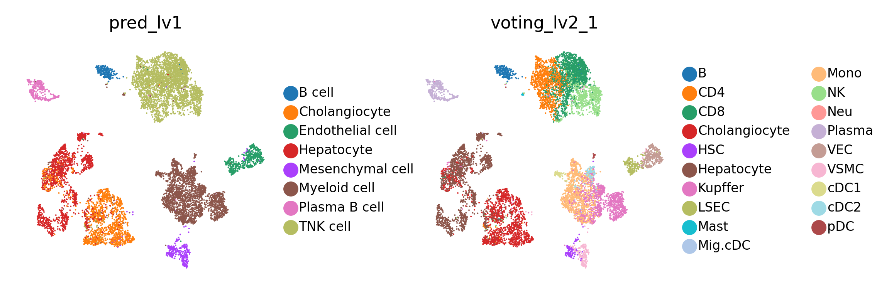

# A demo to annotate an HCC dataset(Lu2022) by LiverCT

Yuhan Fan, 2023/08/13


```python
import os
import gdown
import shutil
import warnings
warnings.filterwarnings("ignore")

from liverct_annot import *
```

    WARNING:root:In order to use the mouse gastrulation seqFISH datsets, please install squidpy (see https://github.com/scverse/squidpy).
    INFO:pytorch_lightning.utilities.seed:Global seed set to 0
    WARNING:root:In order to use sagenet models, please install pytorch geometric (see https://pytorch-geometric.readthedocs.io) and 
     captum (see https://github.com/pytorch/captum).
    WARNING:root:mvTCR is not installed. To use mvTCR models, please install it first using "pip install mvtcr"
    WARNING:root:multigrate is not installed. To use multigrate models, please install it first using "pip install multigrate".


### download trained models from zenodo


```python
url = "https://zenodo.org/record/8239570/files/models.zip"
output_folder = "../test_folder/"
os.makedirs(output_folder) 
gdown.download(url, output_folder + "LiverCT_models.zip", quiet=False)

extract_dir = "../test_folder/LiverCT_models/"
shutil.unpack_archive(output_folder + "LiverCT_models.zip", extract_dir=extract_dir)
os.remove(output_folder + "LiverCT_models.zip")
```

### download query dataset


```python
url = "https://zenodo.org/record/8239570/files/example_data_Lu2022_downsampled.h5ad"
gdown.download(url, output_folder + "example_data_Lu2022_downsampled.h5ad", quiet=False)
```

    Downloading...
    From: https://zenodo.org/record/8239570/files/example_data_Lu2022_downsampled.h5ad
    To: /home/wyh/liver_atlas/code/test_folder/example_data_Lu2022_downsampled.h5ad
    100%|██████████| 245M/245M [14:59<00:00, 272kB/s] 


    '../test_folder/example_data_Lu2022_downsampled.h5ad'


```python
adata = sc.read_h5ad(output_folder + "example_data_Lu2022_downsampled.h5ad")
adata
```


    AnnData object with n_obs × n_vars = 10000 × 43878
        obs: 'orig.ident', 'nCount_RNA', 'nFeature_RNA', 'Cell_ID', 'Sample_ID', 'Original_name_global', 'Original_name_sub', 'State', 'Patient_ID', 'Sample_status', 'Sample_status_original', 'Seq_tech', 'GEO_accession', 'Source', 'Gender', 'Age', 'Disease', 'Fibrotic_status', 'Author', 'Virus_infection', 'TNM', 'batch'
        var: 'features'


### Annotate cell types and intermediate/deviated states


```python
res, latent = cell_states_annot(model_dir=extract_dir + "models/",
                                adata_test=adata, finetune_epoch=20)
res
```

    INFO     Using data from adata.layers["counts"]                                              


    INFO:scvi.data._anndata:Using data from adata.layers["counts"]


    INFO     Registered keys:['X', 'batch_indices', 'labels']                                    


    INFO:scvi.data._anndata:Registered keys:['X', 'batch_indices', 'labels']


    INFO     Successfully registered anndata object containing 10000 cells, 2000 vars, 22        
             batches, 9 labels, and 0 proteins. Also registered 0 extra categorical covariates   
             and 0 extra continuous covariates.                                                  


    INFO:scvi.data._anndata:Successfully registered anndata object containing 10000 cells, 2000 vars, 22 batches, 9 labels, and 0 proteins. Also registered 0 extra categorical covariates and 0 extra continuous covariates.


    INFO     Training for 20 epochs.                                                             


    INFO:scvi.model._scanvi:Training for 20 epochs.
    INFO:pytorch_lightning.utilities.distributed:GPU available: True, used: True
    INFO:pytorch_lightning.utilities.distributed:TPU available: False, using: 0 TPU cores
    INFO:pytorch_lightning.accelerators.gpu:LOCAL_RANK: 0 - CUDA_VISIBLE_DEVICES: [0,1,2,3]


    Epoch 20/20: 100%|██████████| 20/20 [00:22<00:00,  1.11s/it, loss=1.2e+03, v_num=1] 
    2023-08-14 15:32:46.203922 Test set feature selection start
    Normalization has been escaped.
    2023-08-14 15:32:46.203995 Test set lv1 predict start...
    2023-08-14 15:32:47.002077 Test set lv2 predict start...
    2023-08-14 15:32:47.013253 B cell lv2 predict...
    B cell predict is finished in 0.020261
    2023-08-14 15:32:47.033836 Cholangiocyte lv2 predict...
    Cholangiocyte predict is finished in 0.02124
    2023-08-14 15:32:47.055368 Endothelial cell lv2 predict...
    Endothelial cell predict is finished in 0.128875
    2023-08-14 15:32:47.184546 Hepatocyte lv2 predict...
    Hepatocyte predict is finished in 0.01835
    2023-08-14 15:32:47.203668 Mesenchymal cell lv2 predict...
    Mesenchymal cell predict is finished in 0.103612
    2023-08-14 15:32:47.307507 Myeloid cell lv2 predict...
    Myeloid cell predict is finished in 0.328504
    2023-08-14 15:32:47.636372 Plasma B cell lv2 predict...
    Plasma B cell predict is finished in 0.009786
    2023-08-14 15:32:47.646399 TNK cell lv2 predict...
    TNK cell predict is finished in 0.273775


<div>
<style scoped>
    .dataframe tbody tr th:only-of-type {
        vertical-align: middle;
    }

    .dataframe tbody tr th {
        vertical-align: top;
    }

    .dataframe thead th {
        text-align: right;
    }
</style>
<table border="1" class="dataframe">
  <thead>
    <tr style="text-align: right;">
      <th></th>
      <th>pred_lineage</th>
      <th>pred_lv1</th>
      <th>pred_lv2</th>
      <th>intermediate_score</th>
      <th>deviated_score</th>
      <th>intermediate_state</th>
      <th>deviated_state</th>
      <th>proba_lv1</th>
      <th>voting_lv2_1</th>
      <th>voting_lv2_2</th>
    </tr>
  </thead>
  <tbody>
    <tr>
      <th>HCC08T_GCCTCTATCCAATGGT</th>
      <td>Lymphoid</td>
      <td>TNK cell</td>
      <td>CD4</td>
      <td>0.687614</td>
      <td>1.000000</td>
      <td>intermediate</td>
      <td>deviated</td>
      <td>0.980395</td>
      <td>CD4</td>
      <td>CD8</td>
    </tr>
    <tr>
      <th>HCC08N_ACATCAGGTAGCAAAT</th>
      <td>Lymphoid</td>
      <td>TNK cell</td>
      <td>NK</td>
      <td>0.535148</td>
      <td>-0.030936</td>
      <td>intermediate</td>
      <td>non-deviated</td>
      <td>0.994560</td>
      <td>NK</td>
      <td>CD8</td>
    </tr>
    <tr>
      <th>HCC09T_ACCTTTACAATAGCAA</th>
      <td>Lymphoid</td>
      <td>TNK cell</td>
      <td>CD4</td>
      <td>0.646208</td>
      <td>-0.404868</td>
      <td>intermediate</td>
      <td>non-deviated</td>
      <td>0.997496</td>
      <td>CD4</td>
      <td>CD8</td>
    </tr>
    <tr>
      <th>HCC01T_CCACCTATCCTCTAGC</th>
      <td>Myeloid</td>
      <td>Myeloid cell</td>
      <td>Macro</td>
      <td>0.363837</td>
      <td>-0.460342</td>
      <td>intermediate</td>
      <td>non-deviated</td>
      <td>0.919317</td>
      <td>Macro</td>
      <td>Mono</td>
    </tr>
    <tr>
      <th>HCC07T_CGAGCACCAGACGCCT</th>
      <td>Myeloid</td>
      <td>Myeloid cell</td>
      <td>Macro</td>
      <td>0.835844</td>
      <td>0.745284</td>
      <td>intermediate</td>
      <td>deviated</td>
      <td>0.965827</td>
      <td>Macro</td>
      <td>Mono</td>
    </tr>
    <tr>
      <th>...</th>
      <td>...</td>
      <td>...</td>
      <td>...</td>
      <td>...</td>
      <td>...</td>
      <td>...</td>
      <td>...</td>
      <td>...</td>
      <td>...</td>
      <td>...</td>
    </tr>
    <tr>
      <th>HCC03N_CCTAGCTGTGTAACGG</th>
      <td>Endothelial</td>
      <td>Endothelial cell</td>
      <td>LSEC</td>
      <td>0.543299</td>
      <td>-0.747177</td>
      <td>intermediate</td>
      <td>non-deviated</td>
      <td>0.992984</td>
      <td>LSEC</td>
      <td>VEC</td>
    </tr>
    <tr>
      <th>HCC04N_ACACCCTGTCGAATCT</th>
      <td>Lymphoid</td>
      <td>Plasma B cell</td>
      <td>Plasma</td>
      <td>0.000000</td>
      <td>-1.000000</td>
      <td>non-intermediate</td>
      <td>non-deviated</td>
      <td>0.975014</td>
      <td>Plasma</td>
      <td>Unclassified</td>
    </tr>
    <tr>
      <th>HCC08T_GAAGCAGCAATCCGAT</th>
      <td>Lymphoid</td>
      <td>TNK cell</td>
      <td>CD4</td>
      <td>0.848352</td>
      <td>0.668326</td>
      <td>intermediate</td>
      <td>deviated</td>
      <td>0.962216</td>
      <td>CD4</td>
      <td>CD8</td>
    </tr>
    <tr>
      <th>HCC01T_AGCCTAAGTCTGCGGT</th>
      <td>Lymphoid</td>
      <td>TNK cell</td>
      <td>CD8</td>
      <td>0.349967</td>
      <td>1.000000</td>
      <td>intermediate</td>
      <td>deviated</td>
      <td>0.652724</td>
      <td>CD8</td>
      <td>CD4</td>
    </tr>
    <tr>
      <th>HCC04T_CATCCACCAGGCTCAC</th>
      <td>Epithelial</td>
      <td>Hepatocyte</td>
      <td>Hepatocyte</td>
      <td>0.043641</td>
      <td>1.000000</td>
      <td>non-intermediate</td>
      <td>deviated</td>
      <td>0.878540</td>
      <td>Hepatocyte</td>
      <td>Unclassified</td>
    </tr>
  </tbody>
</table>
<p>10000 rows × 10 columns</p>
</div>


### Annotate hepatocyte zonation groups


```python
# select cells labeled as Hepatocyte
hep = adata[res['voting_lv2_1'] == "Hepatocyte"]
# "donor_ID" here is the keyword used as _scvi_batch; if not provided, all cells are treated as one batch
hep.obs['donor_ID'] = list(hep.obs['Patient_ID'])
hep_res, hep_latent = hep_zonation_annot(model_dir=extract_dir + "models/",
                                         hepatocyte_adata=hep, finetune_epoch=20)
hep_res
```

    INFO     Using data from adata.layers["counts"]                                              


    INFO:scvi.data._anndata:Using data from adata.layers["counts"]


    INFO     Registered keys:['X', 'batch_indices', 'labels']                                    


    INFO:scvi.data._anndata:Registered keys:['X', 'batch_indices', 'labels']


    INFO     Successfully registered anndata object containing 1638 cells, 2000 vars, 209        
             batches, 2 labels, and 0 proteins. Also registered 0 extra categorical covariates   
             and 0 extra continuous covariates.                                                  


    INFO:scvi.data._anndata:Successfully registered anndata object containing 1638 cells, 2000 vars, 209 batches, 2 labels, and 0 proteins. Also registered 0 extra categorical covariates and 0 extra continuous covariates.


    INFO     Training for 20 epochs.                                                             


    INFO:scvi.model._scanvi:Training for 20 epochs.
    INFO:pytorch_lightning.utilities.distributed:GPU available: True, used: True
    INFO:pytorch_lightning.utilities.distributed:TPU available: False, using: 0 TPU cores
    INFO:pytorch_lightning.accelerators.gpu:LOCAL_RANK: 0 - CUDA_VISIBLE_DEVICES: [0,1,2,3]


    Epoch 20/20: 100%|██████████| 20/20 [00:03<00:00,  5.55it/s, loss=2.57e+03, v_num=1]


    HCC02T_CAAGATCCACATTTCT       c
    HCC03T_AGCAGCCCACACCGCA       m
    HCC04T_CCGGTAGCATTTCAGG       c
    HCC03N_GAATGAAGTTATTCTC    pp+p
    HCC04N_CGATTGATCTGGCGTG       c
                               ... 
    HCC10L_CGTGAGCCATGCCACG    pp+p
    HCC04T_TTAGGACTCCTAGGGC       c
    HCC06T_CGTCCATGTTCTGTTT       c
    HCC02T_GAAGCAGGTACTTAGC       m
    HCC04T_CATCCACCAGGCTCAC       c
    Name: zonation_pred, Length: 1638, dtype: object


### Visualize query data


```python
latent.obs = pd.concat([adata.obs, res], axis=1)
latent.obs['hep_zonation'] = None
latent.obs['hep_zonation'][hep.obs_names] = list(hep_res)

sc.pp.neighbors(latent, use_rep='X')
sc.tl.umap(latent)

sc.settings.set_figure_params(dpi=200, figsize=(2,2), frameon=False)
sc.pl.umap(latent, color=['pred_lv1', 'voting_lv2_1'], size=20000 / latent.n_obs, legend_fontsize=6)

sc.settings.set_figure_params(dpi=200, figsize=(1.5,1.5), frameon=False)
sc.pl.umap(latent, color=['intermediate_score', 'deviated_score'], size=20000 / latent.n_obs)
sc.pl.umap(latent, color=['intermediate_state', 'deviated_state', 'hep_zonation'], size=20000 / latent.n_obs, legend_fontsize=6)
```


    

    


    

    


    

    

